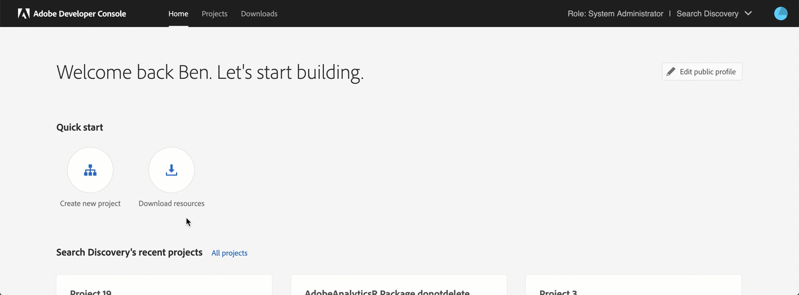
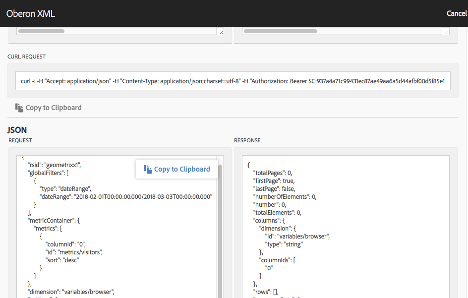

# awoberonr

## Analysis Workspace data extracter

Use the generated JSON request string found in the OberonXML Debugger inside Analysis Workspace to pull data directly into R.  Starter package for understanding the new Adobe Analytics API 2.0 which powers Analysis Workspace.
  
### How to get started

  1. Create the Adobe Console API Project to get the Client_Id and the Client_Secret
  2. Create and add the OAuth arguments to your .Renviron file in your R project.
  3. Get your authorization token by using the function `aw_token()`.
  4. Get your company_id by using the function `get_me()` 
  5. Copy JSON from the Analysis Workspace Oberon debugger and save it as a .json file
  6. Run the `aw_report('filepath.json')` function with the correct file path
  7. Enjoy the new found freedom
  
#### Create the Adobe Console API Project 

  1. Navigate to the following URL: https://console.adobe.io/integrations.
  2. Click the "Create New Project" button.
  3. Click the "Add API" button.
  4. Select the Experience Cloud product icon and then choose "Adobe Analytics' and click "Next".
  5. Select the  OAuth option and then click "Next".
  6. Select "Web" as the platform where you want to the integration.
  7. Add Default redirect URI <code>https://adobeanalyticsr.com/token/result.html</code>
  8. Add Redirect URI pattern <code>https://adobeanalyticsr\.com/token/result\.html</code>
    
**Creating an Adobe Developer OAuth Project in under 60 seconds**

  
#### Set up the .Renviron file

This file is essential to keeping your information secure. It also speeds up analysis by limiting the number of arguments you need to add to every function call.
  
  1. Create a new file and save it with the name '.Renviron'.
  2. Get the following variables from the OAuth project and add them to the file. (see Creating an OAuth Client above)

      * `AW_CLIENT_ID` - OAuth client id found in the Adobe Developer Console
      * `AW_CLIENT_SECRET` - OAuth client secret key found in the Adobe Developer Console

  3. Add Company_id (optional)

      * `AW_COMPANY_ID` - Using the function 'get_me()' you can see all the companies you have access to.

After defining these 3 variables in the .Renviron file, restart your session.  Once restart is complete reload
the awoberonr library, you should be able to run your first data extract using using `aw_report("filepath.json")`.

### Getting the JSON file.

  1. Follow steps 1-6 on this article: https://www.adobe.io/apis/experiencecloud/analytics/docs.html#!AdobeDocs/analytics-2.0-apis/master/reporting-tricks.md
  2. Save the copied json to your working directory using a txt file and saving it as a .json file.
  3. Reference the file path name in the`aw_report("filepath.json")` function
  

